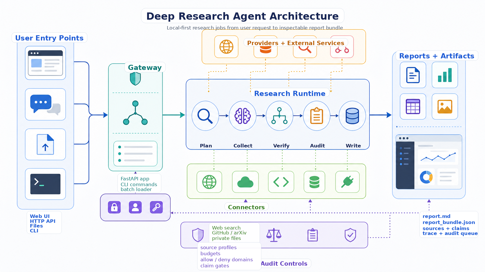

# Deep Research Agent

[](https://github.com/emmmdty/deep-research-agent/actions/workflows/ci.yml)
[](./LICENSE)

English | [简体中文](./README.zh-CN.md)

Deep Research Agent is a local-first research runtime for company and industry analysis. It runs research as auditable jobs, stores checkpoints and events, and emits report bundles with sources, claims, traces, and review artifacts.

## Architecture At A Glance



## Install

```bash
uv sync
cp .env.example .env
```

Edit `.env` with your LLM provider key and optional Tavily key.

## CLI

```bash
uv run python main.py --help
```

Create a job without starting a worker:

```bash
uv run python main.py submit \
  --topic "OpenAI company profile" \
  --source-profile company_trusted \
  --no-worker \
  --json
```

Work with a job:

```bash
uv run python main.py status --job-id <job_id>
uv run python main.py watch --job-id <job_id>
uv run python main.py cancel --job-id <job_id>
uv run python main.py retry --job-id <job_id>
uv run python main.py resume --job-id <job_id>
uv run python main.py refine --job-id <job_id> --instruction "Focus on product revenue signals"
uv run python main.py bundle --job-id <job_id> --json
```

Batch submit:

```bash
uv run python main.py batch run --file examples/batch_requests.json --json
```

## API

Start the local API:

```bash
uv run uvicorn deep_research_agent.gateway.api:app --reload
```

Open the generated API docs at `http://127.0.0.1:8000/docs`.

## Web UI

```bash
npm ci --prefix apps/gui-web
npm run dev --prefix apps/gui-web
```

The UI opens at `http://127.0.0.1:5173` and talks to the local API at `http://127.0.0.1:8000` by default. Set `VITE_DRA_API_BASE_URL` to point it at another local API URL.

## Artifacts

Runtime output is stored under:

```text
workspace/research_jobs/<job_id>/
```

Stable artifact names include `report.md`, `report.html`, `report_bundle.json`, `sources.json`, `claims.json`, `audit_decision.json`, `review_queue.json`, `claim_graph.json`, `trace.jsonl`, and `manifest.json`.

## Docs

- [User Guide](./docs/USER_GUIDE.md)
- [API](./docs/API.md)
- [Artifacts](./docs/ARTIFACTS.md)
- [Architecture](./docs/ARCHITECTURE.md)

## License

MIT. See [LICENSE](./LICENSE).
