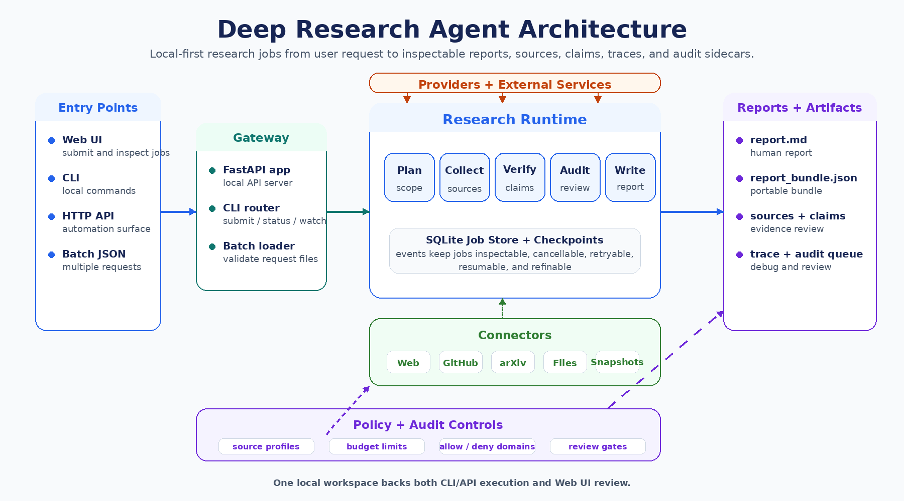

# Deep Research Agent

[](https://github.com/emmmdty/deep-research-agent/actions/workflows/ci.yml)
[](https://emmmdty.github.io/deep-research-agent/)
[](./LICENSE)

English | [简体中文](./README.zh-CN.md)

**An evidence-first multi-agent deep research system.** It plans a research task into a task DAG,
runs parallel researcher and critic agents through governed model/tool gateways, audits every
critical claim against frozen evidence, and delivers an auditable report bundle — not a chat answer.

## Why This Project

Deep research (OpenAI Deep Research, Gemini Deep Research, Perplexity, STORM...) exploded in 2025.
This project asks a different question: *when the answer is wrong, can you prove it?*

- **Multi-agent, measured** — parallel researcher agents + a critic agent, orchestrated on a
  bounded DAG scheduler; the value of each component is proven by deterministic ablations, not
  asserted.
- **Evidence-first output** — the deliverable is a machine-readable report bundle where every
  critical claim carries an evidence span pointing into a frozen, immutable corpus manifest.
- **Industry-grade reliability** — checkpointed jobs that survive cancel/retry/resume/stale
  recovery; claim graphs, audit gates, and human review queues as first-class artifacts.

[Live demo](https://emmmdty.github.io/deep-research-agent/) · [Competitive landscape](./docs/final/COMPETITIVE_LANDSCAPE.md) · [Repository map](./docs/REPO_MAP.md)

## Architecture At A Glance



The canonical runtime is `src/deep_research_agent/`:

| Layer | Modules | Responsibility |
| --- | --- | --- |
| Agent orchestration | `orchestration/` (`dag.py`, `scheduler.py`, `workers.py`, `reducer.py`) | Compile a research brief into an immutable task DAG; bounded asyncio scheduler runs ready tasks in parallel (up to 8 workers) with typed message passing |
| Agent roles | `ResearchPlanner` (researcher), critic tasks (`CriticDecision`) | Parallel researchers per objective; a critic audits dependencies and emits accepted/qualified/contradicted/unresolved decisions |
| Governance | `tool_gateway/`, `model_runtime/`, `policy/` | Role allow-lists, idempotency, caching, budget caps, retries; per-role model fallback chains with AES-GCM credentials |
| Evidence & audit | `auditor/`, `evidence_store/`, `corpus/` | Claim graph with support edges, conflict sets, review queues; frozen corpus manifests; provenance snapshots |
| Deliverable | `reporting/bundle_v2.py` | Deterministic reduction → audit → `report_bundle.json` (+ `report.md/html`) with sidecar artifacts |
| Reliability | `research_jobs/`, `observability/` | Checkpoints, events, leases, heartbeats, resume/retry/refine; credential-safe OpenTelemetry spans |
| Product surface | `gateway/`, `product/`, `apps/gui-web/` | CLI, local HTTP API (SSE event streams), authenticated multi-tenant product API on PostgreSQL, React workspace UI |

Root packages such as `services/`, `connectors/`, `artifacts/`, `policies/`, `tools/` and
`evaluation/` are compatibility or diagnostic layers. See [Repository Map](./docs/REPO_MAP.md).

## How A Research Job Runs

```
user topic → ResearchPlanner.plan() → ResearchDAG (research tasks ∥ critic task)
   → ResearchScheduler.run() [bounded asyncio, ≤8 workers, typed TaskSpec/WorkerOutput]
   → ToolGateway (governed retrieval) → ModelRegistry (role fallback chains)
   → EvidenceReducer.reduce() → EvidenceAuditor.audit()
   → ReportBundleCompilerV2.compile() → report_bundle.json + report.md/html
   → job artifacts under workspace/research_jobs/<job_id>/
```

Every critical claim in the bundle must resolve to an evidence span inside the frozen corpus
manifest; unverifiable claims are routed to a human review queue. The full lifecycle is documented
in [docs/architecture.md](./docs/architecture.md) and [docs/USER_GUIDE.md](./docs/USER_GUIDE.md).

## Evaluation & Benchmark Evidence

The release gate is deterministic and reproducible locally — no API keys, no network:

| Evidence | Where | Result |
| --- | --- | --- |
| Authoritative smoke gate | `evals/reports/phase5_local_smoke/` | 5 suites × smoke_local, all passed |
| Native regression | `evals/reports/native_regression/` | company12/industry12/trusted8/file8/recovery6 passed |
| Headline metrics | `evals/reports/followup_metrics/headline_metrics.json` | completion rate 1.0, critical claim support precision 1.0, citation error rate 0.0 |
| Ablations (multi-agent value) | `evals/reports/followup_metrics/ablation_summary.md` | see table below |
| External benchmark adapters | `evals/external/` + `portfolio_summary.json` | BrowseComp/GAIA/LongBench-v2/LongFact/Facts grounding guarded smoke |
| Value scorecard | [docs/final/VALUE_SCORECARD.md](./docs/final/VALUE_SCORECARD.md) | full metric definitions and results |

### Ablation Evidence: Why The Components Matter

Deterministic ablations prove each mechanism has a measurable causal effect:

| Ablation | Delta when removed |
| --- | --- |
| Audit gate (`audit_on_vs_off`) | unsupported claim leakage → 1.0 |
| Evidence-first synthesis (`evidence_first_vs_baseline`) | citation error rate → 1.0, provenance drops |
| Rerank/edge selection (`rerank_on_vs_off`) | critical claim support precision 1.0 → 0.5 |
| Strict source policy (`strict_source_policy_vs_relaxed`) | policy compliance 1.0 → 0.333 |

Run everything yourself:

```bash
uv sync --group dev
uv run python main.py eval run --suite company12 --variant smoke_local
uv run python main.py benchmark run --help
```

## Competitive Positioning

The 2025 deep research landscape is dominated by closed products (OpenAI, Gemini, Perplexity)
that deliver reports with post-hoc citations, and by open frameworks (STORM, LangChain
open_deep_research, smolagents) that omit audit trails. This project differentiates on
**auditability and governed evidence** — the same pain points Anthropic documents in its
multi-agent research system post (citation attribution, source quality, checkpoint/recovery).
See [docs/final/COMPETITIVE_LANDSCAPE.md](./docs/final/COMPETITIVE_LANDSCAPE.md) for the
evidence-backed comparison.

## Quick Start

```bash
uv sync --group dev
cp .env.example .env        # offline demo needs no secrets
uv run python main.py --help

uv run python main.py submit \
  --topic "Anthropic company profile" \
  --source-profile company_trusted \
  --allow-domain anthropic.com \
  --json
```

Local web demo (no Docker, file-backed SQLite, offline deterministic mode):

```bash
PRODUCT_DATABASE_URL=sqlite+pysqlite:///./workspace/product.db \
PRODUCT_OFFLINE_MODE=true \
uv run uvicorn deep_research_agent.gateway.api:app --reload
# separate terminal
npm run dev --prefix apps/gui-web    # open http://127.0.0.1:5173
```

Full Compose profile (PostgreSQL/pgvector + MinIO + GROBID + Phoenix) with the credential-free
offline scheduler:

```bash
docker compose up --build     # open http://127.0.0.1:8000
```

Live scholarly research requires an explicit `SCHEDULER_FACTORY_PATH`; the runtime never silently
falls back from production to offline execution.

## Artifact Contract

Completed jobs write `workspace/research_jobs/<job_id>/`:

- `report_bundle.json` — authoritative machine-readable output
- `report.md`, `report.html` — reader-facing renderings
- `claims.json`, `sources.json`, `audit_decision.json`, `review_queue.json`, `claim_graph.json` — audit sidecars
- `trace.jsonl`, `manifest.json`, `review_actions.jsonl` — execution and review records

```bash
uv run python main.py bundle --job-id <job_id> --json
curl -s http://127.0.0.1:8000/v1/research/jobs/<job_id>/bundle
```

## Repository Layout

```text
src/deep_research_agent/  canonical runtime (orchestration, auditor, reporting, product...)
apps/gui-web/             React workspace UI (reports, evidence, claim graph, memory, admin)
apps/demo-site/           static GitHub Pages demo (report browser, claim graph, trace replay)
configs/                  runtime and source-profile config
evals/                    deterministic eval assets, reports, and fixtures
docs/                     reviewer docs (index, architecture, benchmarks, final)
tests/                    regression tests
scripts/                  smoke, eval, and diagnostic commands
legacy/                   archived graph-first runtime (orchestrator-v1 compatibility path)
```

## Current Limits

- Deployment profile is a small-team Compose stack, not a horizontally scaled SaaS control plane.
- Deterministic eval is authoritative; live-provider quality/cost comparisons are roadmap items.
- Open-web search is discovery-only; critical claims are limited to governed, frozen sources.
- Memory is explicit CRUD plus subject-scoped recall; conversation-to-memory promotion is roadmap.

## Roadmap

- Measure and harden queue/object-storage adapters after the Postgres/MinIO profile is exercised.
- Live-provider head-to-head comparisons (ours vs open_deep_research vs gpt-researcher) with cost
  and quality telemetry.
- Expand GAIA/BrowseComp guarded subset coverage; review integrity findings before scaling.
- Human-in-the-loop review flows that recompile or annotate delivered bundles.

## License

MIT. See [LICENSE](./LICENSE).
