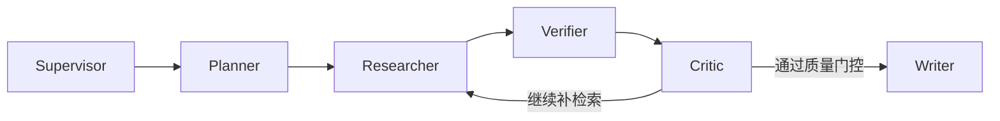

# 项目展示

## 项目定位

本项目是一个面向 `Deep Research` 场景的可信研究型 LLM Agent 系统，核心不是“生成更长的报告”，而是让多源研究结果具备更强的证据可信度、质量门控和可复现评测能力。

## 系统结构

主工作流为：

关键能力：

- `Verifier`：把来源整理成证据簇，跟踪支持/弱支持/冲突状态
- `Quality Gate`：在 benchmark profile 下阻断证据不足的样本，避免“假完成”
- `Skills / MCP / Builtin Tools`：统一 capability registry，支持 tool routing 与扩展能力发现
- `Benchmark / Ablation`：输出 `scorecard + legacy_metrics + benchmark_health`，并支持 `ours_base / ours_verifier / ours_gate / ours_full` 对照

## 为什么不是普通 RAG

- 普通 RAG 更关注“能召回”和“能回答”
- 本项目更关注“哪些证据可以被信任、哪些结论应该被拦住、哪些结果能稳定复现”
- `case-study` 任务只接受 `官方站点 + 一手仓库` 证据，不把综述、聚合页和视频当作真实落地案例

## 一次真实修复案例

早期版本的 `case-study` 方面经常被泛化查询污染：系统会找到大量“Agent 综述”或“框架介绍”，却拿不到真正的官方案例证据，导致报告虽然生成成功，但实际不可信。

后续修复包括：

- 为 `case-study` 单独设计 query bundle，优先 `site:官方域名 + case study/customer story/deployment`
- 增加 GitHub 一手仓库 enrichment，只把带生产/部署/示例信号的官方 repo 视为强证据
- 把 `quality_gate` 改为严格阻断语义，案例证据不足时直接失败，不再继续写报告

## 展示建议

- 简历里重点写：`Verifier + Quality Gate + Skills/MCP + Benchmark/Ablation`
- 演示时优先展示 `scripts/run_portfolio12_release.py --release-mode hybrid`
- 面试时优先讲“如何定义可信证据”和“为什么要允许失败而不是伪装成完成”
